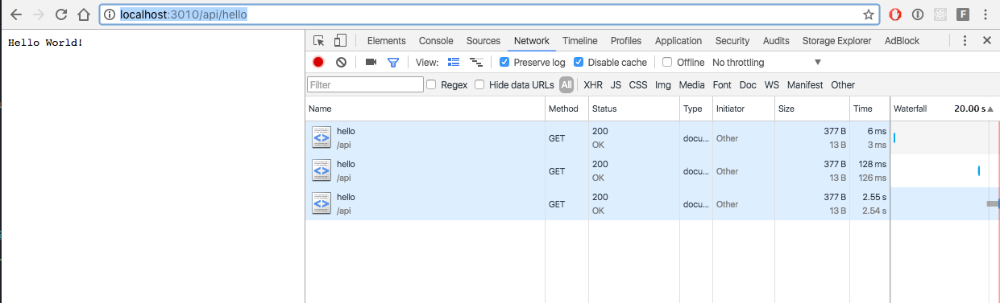

# yada-async-test
Testing an async endpoint with Yada

## What I expect from an async endpoint:

* Other endpoints remain responsive no matter how many request to async endpoints are being processed.

## How to reproduce?

* Clone this repository
* In a terminal sesssion: `cd yada-async-test/edge`
* `boot dev` and wait for a webserver to be started at port `3010`
* Visit [The Swagger UI](http://localhost:3010/swagger/?url=http://localhost:3010/api/swagger.json#) in a browser. There you'll see two endpoints, `async` and `hello`.
* In another terminal session: `cd yada-async-test/external`.
* `lein repl`
* `(dev)`
* `(go)` and wait for a webserver to be started at port `3000`. This service has one endpoint called `example` which will wait 5 seconds before it returns a response.

Now for the test:

* In another browser tab, visit `http://localhost:3010/api/hello` while having a Network tab open in devtools so you can see the response time. On my machine this was about `6ms`. Click preserve log, so you can compare requests when you hit refresh.

* In the [The Swagger UI](http://localhost:3010/swagger/?url=http://localhost:3010/api/swagger.json) fire 20 request. Meanwhile, refresh the tab with the call to `api/hello` a couple of times and notice how it becomes less responsive. On my machine it sometimes takes a couple of seconds before a request comes back. This is different from my expectation:

## Solution

    ab -n 20 -c 20 -v 10 -H 'Accept: application/json' 'http://localhost:3010/api/async'
    ab -n 20 -c 20 -v 999 -H 'Accept: text/plain' 'http://localhost:3010/api/hello'
    
The problem was that there is a maximum number of concurrent requests to the same
domain in browsers. Use a different tool like Apache Bench. Thanks
to [thegeez](https://github.com/thegeez) for pointing me to the
solution.
